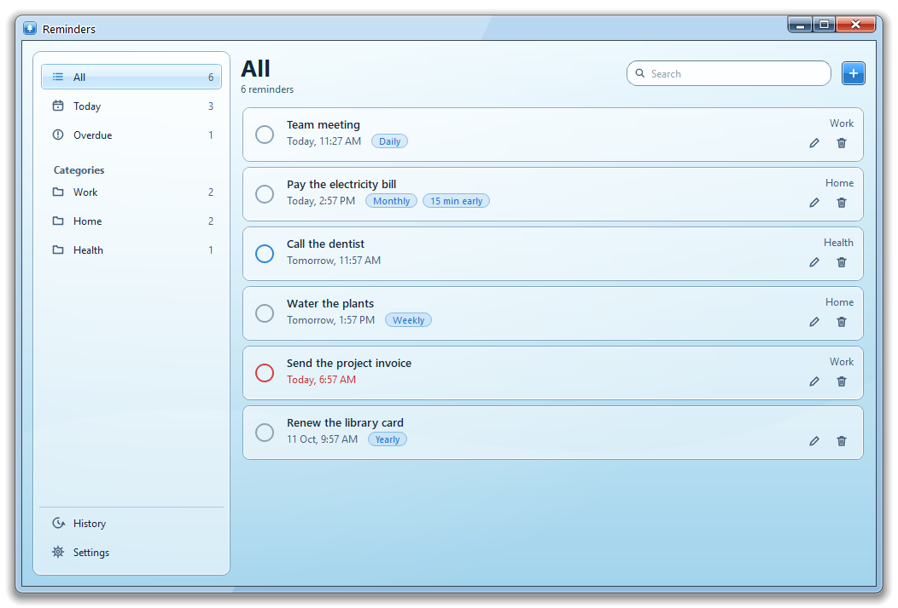
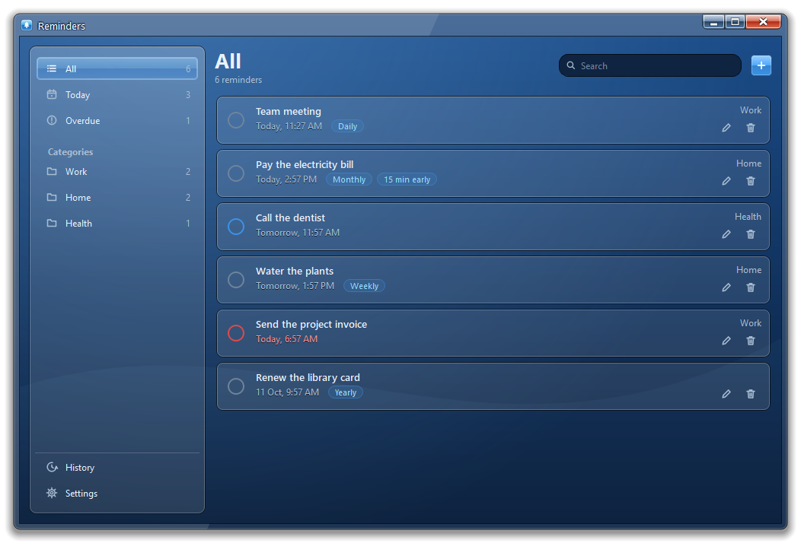
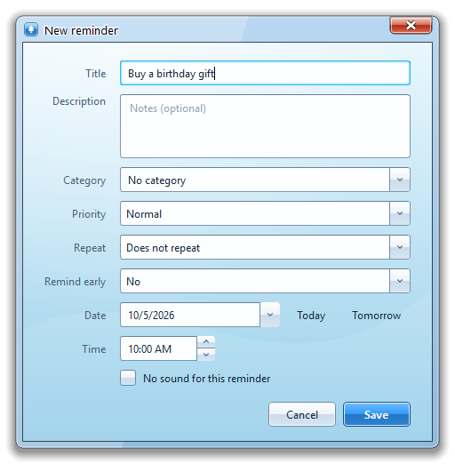
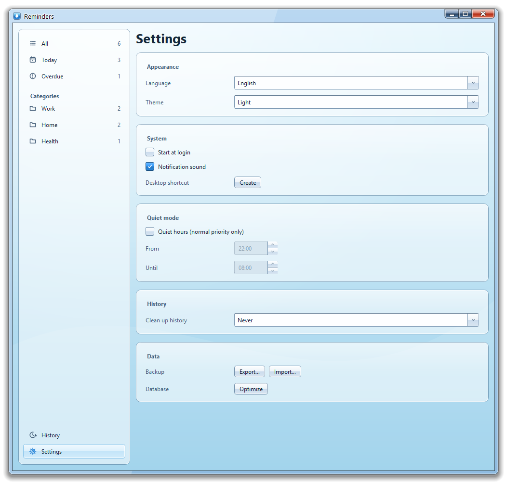
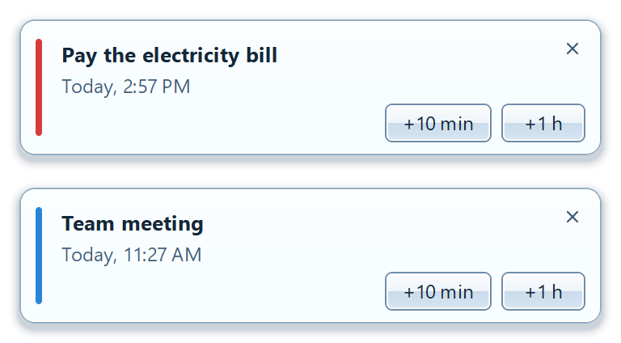
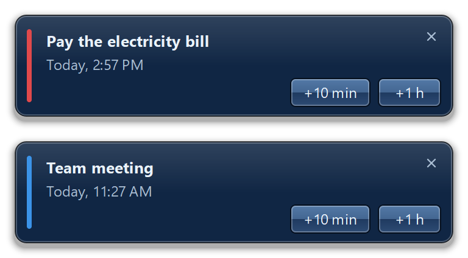

<div align="center">

# 🔔 Reminders

**A fast, beautiful desktop reminder app with a glass-style interface.**

[](LICENSE)


English · [Русский](README.ru.md) · [Українська](README.uk.md)



</div>

## Features

- **Flexible reminders** — title, notes, category, date and time, normal or high priority.
- **Repeats** — daily, weekly, monthly, yearly; deleting a series can be undone.
- **Early alerts** — get a heads-up from 5 minutes up to a day before.
- **Smart notifications** — snooze for 10 minutes, 1 hour or until tomorrow; mute the sound per reminder.
- **Quiet hours** — only high-priority reminders get through on a schedule.
- **Organized** — Today, Overdue and your own categories, search, drag-and-drop ordering.
- **History** — restore completed reminders; automatic cleanup after 30 or 90 days.
- **Your data stays yours** — local SQLite database, automatic backup, JSON export and import, one-click optimization.
- **Tray, autostart, desktop shortcut**, light and dark themes.
- **Three languages** — English, Русский, Українська.

## Screenshots

<table>
  <tr>
    <td align="center"><br><sub>Light theme</sub></td>
    <td align="center"><br><sub>Dark theme</sub></td>
  </tr>
  <tr>
    <td align="center"><br><sub>New reminder</sub></td>
    <td align="center"><br><sub>Settings</sub></td>
  </tr>
</table>

### Notifications

<table>
  <tr>
    <td align="center"><br><sub>Light</sub></td>
    <td align="center"><br><sub>Dark</sub></td>
  </tr>
</table>

## Getting started

**Requirements:** Python 3.9+ and PyQt5. Windows and Linux.

```bash
pip install PyQt5
python main.pyw
```

Use `--tray` to start minimized to the system tray.

## Shortcuts

| Key | Action |
|---|---|
| `Ctrl+N` | New reminder |
| `Ctrl+F` | Search |
| `Enter` | Edit selected |
| `Delete` | Delete selected |

## Data

Everything is stored next to the program in the `.reminders-data` folder, so the app is fully portable. To move it or make a copy, copy that folder or use **Settings → Data → Export**.

## License

Distributed under the **GNU General Public License v3.0**. See [LICENSE](LICENSE).
