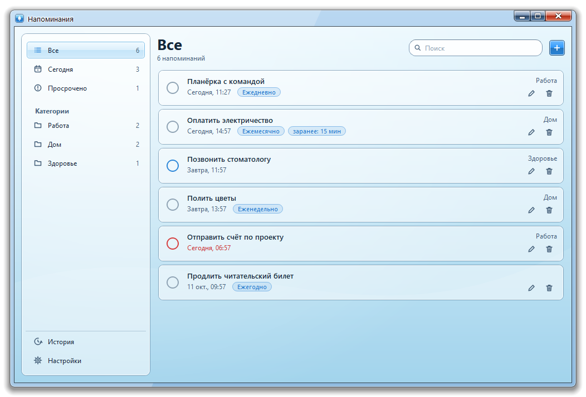
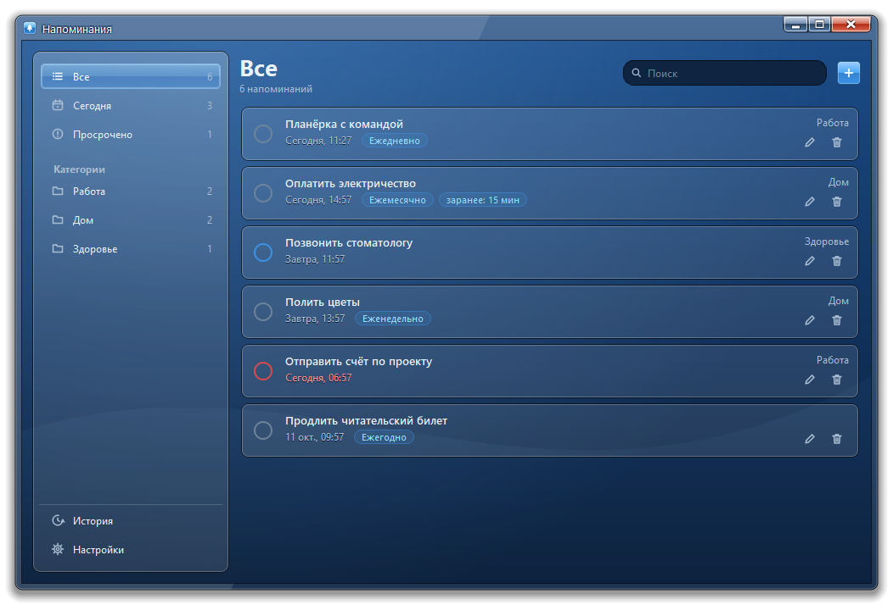
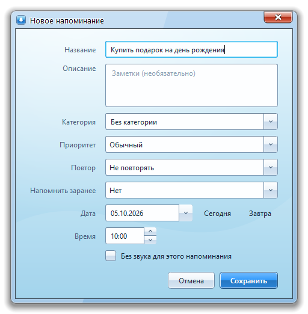
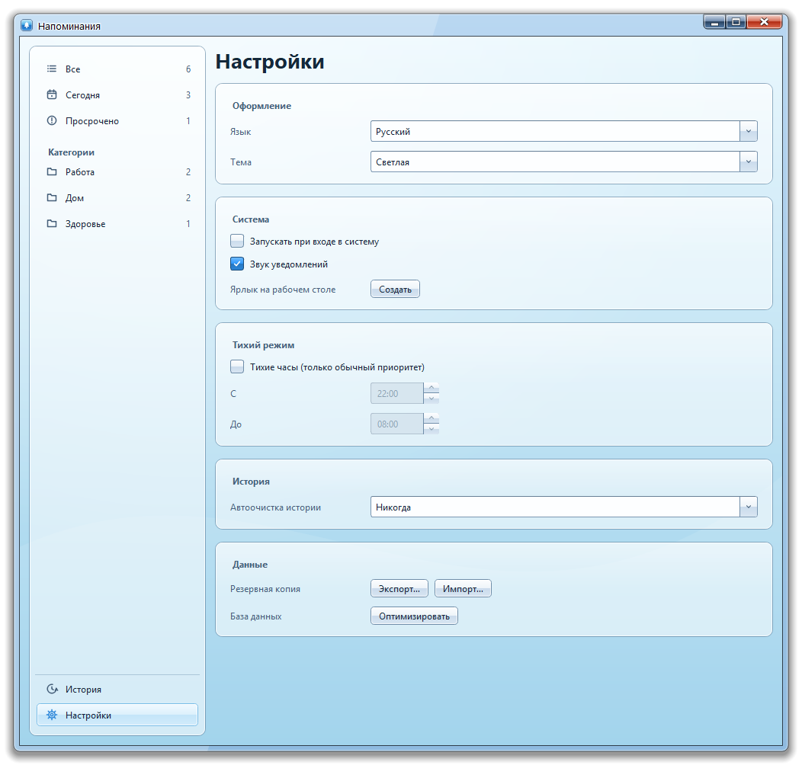
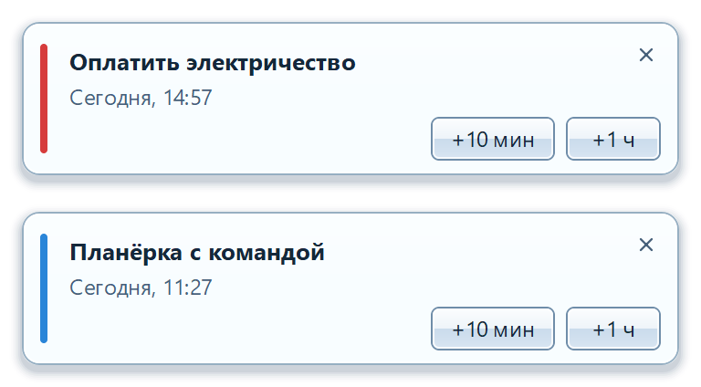
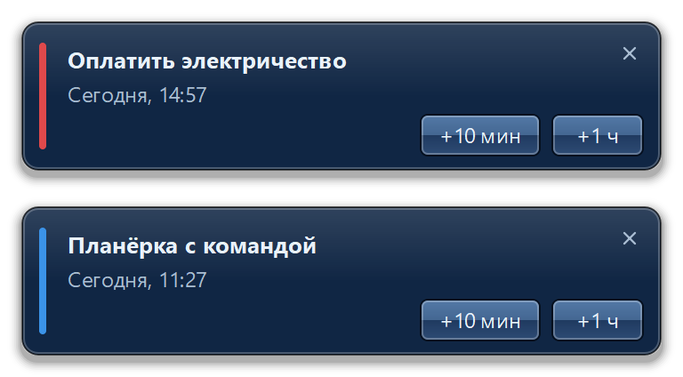

<div align="center">

# 🔔 Напоминалка

**Быстрое и красивое настольное приложение для напоминаний в стеклянном стиле.**

[](LICENSE)


[English](README.md) · Русский · [Українська](README.uk.md)



</div>

## Возможности

- **Гибкие напоминания** — заголовок, заметки, категория, дата и время, обычный или высокий приоритет.
- **Повторы** — ежедневно, еженедельно, ежемесячно, ежегодно; удаление серии можно отменить.
- **Напоминание заранее** — от 5 минут до суток до события.
- **Умные уведомления** — отложить на 10 минут, час или до завтра; звук можно отключить для отдельного напоминания.
- **Тихие часы** — по расписанию звучат только напоминания с высоким приоритетом.
- **Порядок** — «Сегодня», «Просроченные» и свои категории, поиск, сортировка перетаскиванием.
- **История** — выполненные напоминания можно вернуть; автоочистка через 30 или 90 дней.
- **Данные только у вас** — локальная база SQLite, автоматическая резервная копия, экспорт и импорт в JSON, оптимизация базы одной кнопкой.
- **Трей, автозапуск, ярлык на рабочем столе**, светлая и тёмная темы.
- **Три языка** — English, Русский, Українська.

## Скриншоты

<table>
  <tr>
    <td align="center"><br><sub>Светлая тема</sub></td>
    <td align="center"><br><sub>Тёмная тема</sub></td>
  </tr>
  <tr>
    <td align="center"><br><sub>Новое напоминание</sub></td>
    <td align="center"><br><sub>Настройки</sub></td>
  </tr>
</table>

### Уведомления

<table>
  <tr>
    <td align="center"><br><sub>Светлое</sub></td>
    <td align="center"><br><sub>Тёмное</sub></td>
  </tr>
</table>

## Быстрый старт

**Требования:** Python 3.9+ и PyQt5. Windows и Linux.

```bash
pip install PyQt5
python main.pyw
```

Флаг `--tray` запускает приложение сразу в системном трее.

## Горячие клавиши

| Клавиши | Действие |
|---|---|
| `Ctrl+N` | Новое напоминание |
| `Ctrl+F` | Поиск |
| `Enter` | Изменить выбранное |
| `Delete` | Удалить выбранное |

## Данные

Всё хранится рядом с программой, в папке `.reminders-data`, поэтому приложение полностью переносимое. Чтобы перенести данные или сделать копию, скопируйте эту папку или воспользуйтесь **Настройки → Данные → Экспорт**.

## Лицензия

Распространяется по лицензии **GNU General Public License v3.0**. См. [LICENSE](LICENSE).
