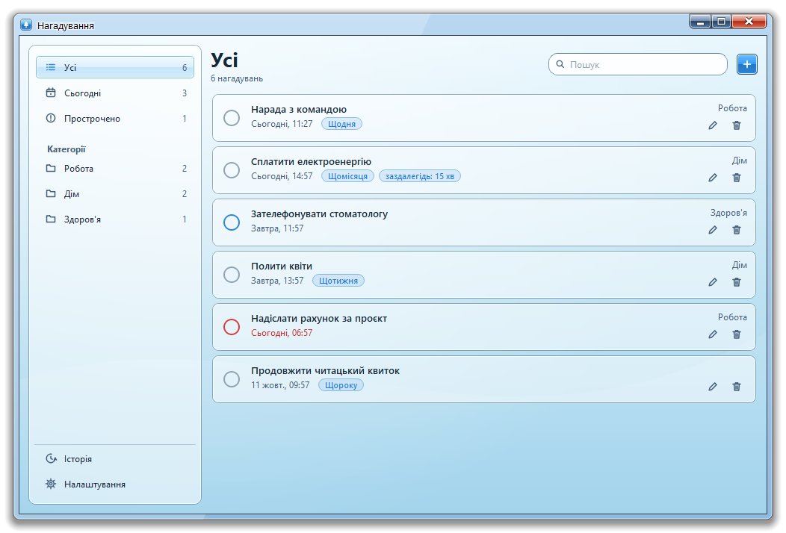
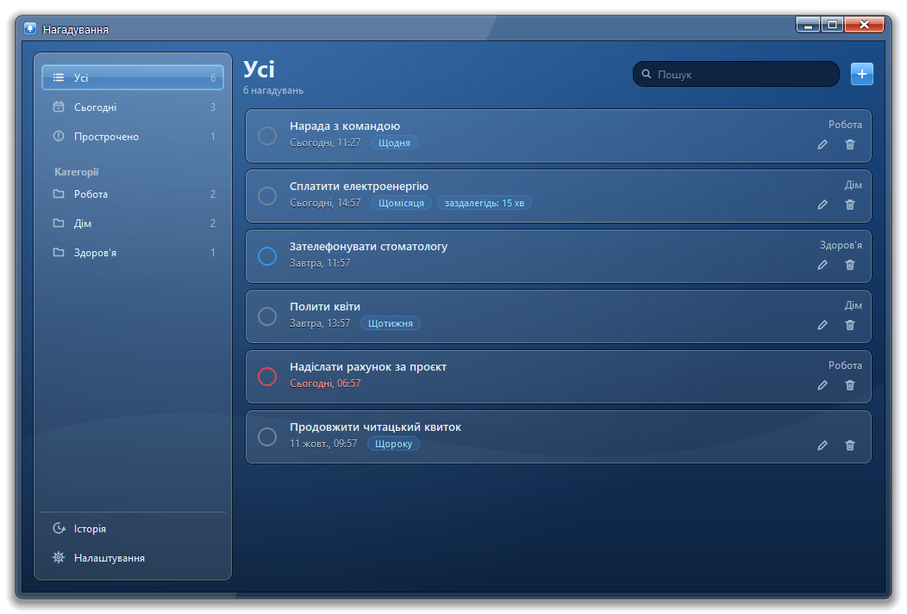
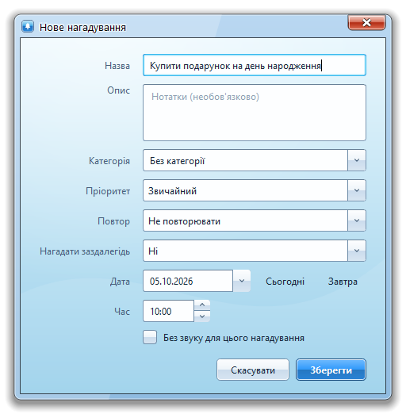
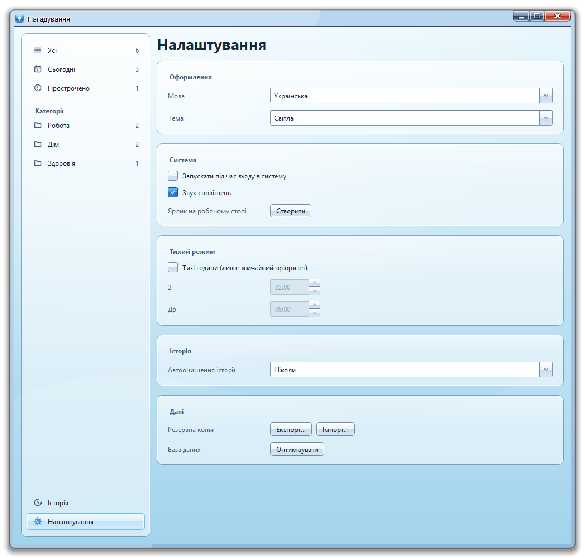
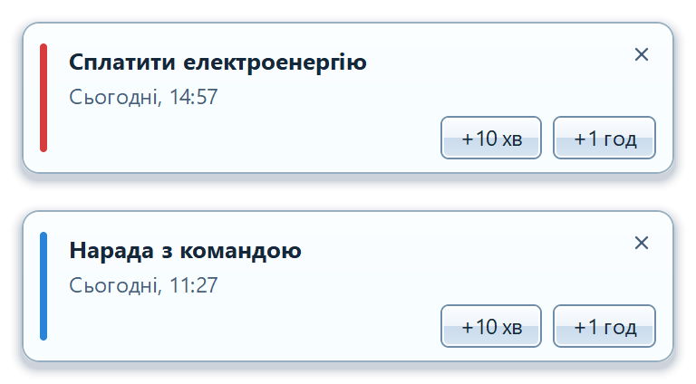
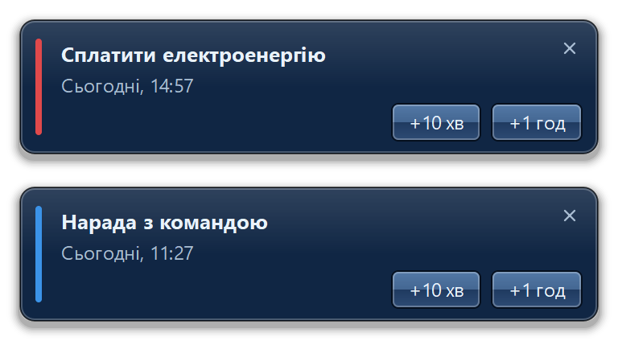

<div align="center">

# 🔔 Нагадування

**Швидкий і гарний настільний застосунок для нагадувань у скляному стилі.**

[](LICENSE)


[English](README.md) · [Русский](README.ru.md) · Українська



</div>

## Можливості

- **Гнучкі нагадування** — заголовок, нотатки, категорія, дата й час, звичайний або високий пріоритет.
- **Повтори** — щодня, щотижня, щомісяця, щороку; видалення серії можна скасувати.
- **Нагадування заздалегідь** — від 5 хвилин до доби до події.
- **Розумні сповіщення** — відкласти на 10 хвилин, годину або до завтра; звук можна вимкнути для окремого нагадування.
- **Тихі години** — за розкладом лунають лише нагадування з високим пріоритетом.
- **Лад** — «Сьогодні», «Прострочені» та власні категорії, пошук, сортування перетягуванням.
- **Історія** — виконані нагадування можна повернути; автоочищення через 30 або 90 днів.
- **Дані лише у вас** — локальна база SQLite, автоматична резервна копія, експорт та імпорт у JSON, оптимізація бази однією кнопкою.
- **Трей, автозапуск, ярлик на робочому столі**, світла й темна теми.
- **Три мови** — English, Русский, Українська.

## Скріншоти

<table>
  <tr>
    <td align="center"><br><sub>Світла тема</sub></td>
    <td align="center"><br><sub>Темна тема</sub></td>
  </tr>
  <tr>
    <td align="center"><br><sub>Нове нагадування</sub></td>
    <td align="center"><br><sub>Налаштування</sub></td>
  </tr>
</table>

### Сповіщення

<table>
  <tr>
    <td align="center"><br><sub>Світле</sub></td>
    <td align="center"><br><sub>Темне</sub></td>
  </tr>
</table>

## Швидкий старт

**Вимоги:** Python 3.9+ та PyQt5. Windows і Linux.

```bash
pip install PyQt5
python main.pyw
```

Прапорець `--tray` запускає застосунок одразу в системному треї.

## Гарячі клавіші

| Клавіші | Дія |
|---|---|
| `Ctrl+N` | Нове нагадування |
| `Ctrl+F` | Пошук |
| `Enter` | Змінити вибране |
| `Delete` | Видалити вибране |

## Дані

Усе зберігається поруч із програмою, у теці `.reminders-data`, тож застосунок повністю переносний. Щоб перенести дані або зробити копію, скопіюйте цю теку або скористайтеся **Налаштування → Дані → Експорт**.

## Ліцензія

Поширюється за ліцензією **GNU General Public License v3.0**. Див. [LICENSE](LICENSE).
